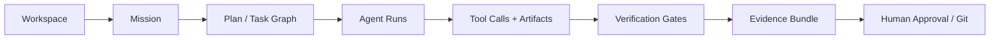

<div align="center">
  

# Krevyx

### Local-first AI engineering workspace — evolving from OllamaX

Krevyx is an independent Electron desktop project for local and cloud AI agents, Ollama, MCP tools, multi-agent workflows, project context, audit tooling and a headless CLI.

[](https://github.com/yasinkaya701/OllamaX/releases/latest)
[](https://github.com/yasinkaya701/OllamaX/actions/workflows/ci.yml)
[](LICENSE)

</div>

## Current product — real v3.26 desktop UI

The repository started as **OllamaX** and evolved into **Krevyx**. The screenshot below is the real current application UI from this repository — not a concept render or a generated mockup.

<p align="center">
  
</p>

The current generation already includes local Ollama execution, configurable cloud providers, reusable agents, orchestration, MCP integration, workflows, plugins, audit tooling, cost visibility and a CLI. The next major development is not another collection of chat features: it is a structural move toward a **task-first, evidence-backed agent workspace**.

## v4 direction

Krevyx v4 is designed around one flagship workflow:

> Open a repository → understand it → define a mission → plan tasks → run agents/tools safely → verify the result → inspect evidence and diff → approve the final Git action.



### Today → v4

| Current v3.26 baseline | v4 target |
| --- | --- |
| Chat and agent surfaces | Workspace + durable missions |
| Agent delegation | Dependency-aware task scheduler |
| Provider selection | Capability-aware model routing |
| Tool approvals | Scoped permission engine + isolation |
| Audit logs | Correlated run journal + evidence |
| Agent output | Verified claims backed by tests/build/review |
| Project context | Incremental repository intelligence |
| Reusable prompts/workflows | Versioned engineering Skills |
| Chat-centric UI | Task board, run timeline, diff and evidence views |

The implementation blueprint is intentionally detailed and migration-oriented:

**[Read the full Krevyx v4 Execution Plan →](docs/KREVYX_V4_EXECUTION_PLAN.md)**

It defines the domain model, target module boundaries, `ipc:4:*` contract, workspace indexing, model router, scheduler, permissions, worktree isolation, evidence/verification engine, memory, Skills, v4 UX, Git delivery, observability, security, testing, CI gates, migration rules, risks, 29 PR-sized milestones and a ready-to-assign engineering backlog.

## Current highlights

- **Local-first inference** — discover and run Ollama models locally.
- **Multi-provider support** — use configured cloud providers when desired.
- **Agents and orchestration** — reusable agents, teams, delegation and orchestration surfaces.
- **MCP** — connect MCP servers and tool sets.
- **Composer/workflows** — execute multi-step flows with project context.
- **Tools and approvals** — filesystem/shell/web-oriented actions with guarded execution paths.
- **Audit and cost visibility** — inspect execution history and usage.
- **Headless CLI** — run automation-oriented flows without opening the desktop UI.

## Why v4 is a larger step

The core v4 object is no longer a chat message. It is a durable engineering mission:

```text
Workspace
└── Mission
    ├── Task
    │   ├── AgentRun
    │   │   ├── ToolCall
    │   │   └── Artifact
    │   └── VerificationRun
    │       └── Evidence
    └── Task ...
```

A task should move through states such as **UNVERIFIED → TESTED → REVIEWED → VERIFIED**. A model saying “done” is not sufficient; required gates must provide evidence.

## Getting started

Requirements: **Node.js 22+**, **pnpm 11+**, Git, and optionally Ollama for local models.

```bash
git clone https://github.com/yasinkaya701/OllamaX.git
cd OllamaX
corepack enable
corepack prepare pnpm@11 --activate
pnpm install --frozen-lockfile
pnpm start
```

Build packages with:

```bash
pnpm run build:win
pnpm run build:mac
pnpm run build:linux
```

The current macOS package target is Apple Silicon (`arm64`).

## CLI

```bash
node bin/krevyx.js run "Summarize this project" --mode local
```

Profiles can also be exported/imported with:

```bash
node bin/krevyx.js profile export my-studio.krevyxprofile
node bin/krevyx.js profile import my-studio.krevyxprofile
```

## Development

Before opening a pull request:

```bash
pnpm run lint
pnpm test
pnpm run test:ci
pnpm run audit:verify
```

Current high-level layout:

```text
src/        Electron main process, preload bridge, renderer and shared modules
bin/        headless CLI
tests/      Jest and integration tests
scripts/    development and verification utilities
docs/       architecture, setup, release and v4 execution documentation
assets/     real project logo, icons and current application preview
```

## Documentation

- [Krevyx v4 Execution Plan](docs/KREVYX_V4_EXECUTION_PLAN.md)
- [Architecture](docs/ARCHITECTURE.md)
- [Feature catalog](docs/FEATURES.md)
- [API notes](docs/API.md)
- [Project status](docs/PROJECT_STATUS.md)
- [Contributing](CONTRIBUTING.md)
- [Security](SECURITY.md)
- [Changelog](CHANGELOG.md)

## Project status

Krevyx is an independent personal open-source project maintained by [Yasin Kaya](https://github.com/yasinkaya701). It is actively evolving and should be evaluated before use in sensitive or production-critical environments.

Krevyx is not affiliated with Ollama or with any model-provider vendor.

## License

Released under the [MIT License](LICENSE).

Copyright © 2026 Yasin Kaya.
