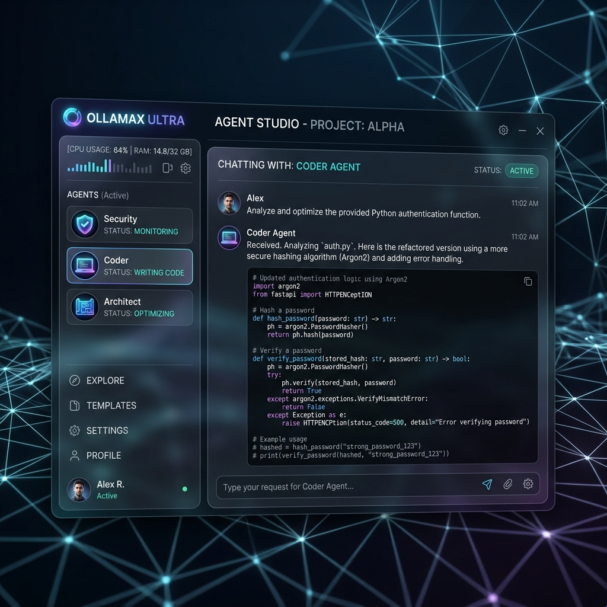

<div align="center">



# 🤖 OllamaX Ultra Pro
### Industrial-Grade AI Operating System & Agent Studio

**OllamaX Ultra**, yerel gücü (Ollama) ve bulut zekasını (OpenAI, Claude, Gemini) hibrit bir mimaride birleştiren, çoklu ajan orkestrasyonuna odaklanmış profesyonel bir yapay zeka işletim sistemidir.

[Özellikler](#-özellikler) • [Kurulum Rehberi](#-kurulum-rehberi) • [Windows](#-windows-kurulum) • [macOS](#-macos-kurulum) • [Kullanım](#-kullanım-kılavuzu)

</div>

---

## ✨ Özellikler

- **🛡️ Red Team / Security Audit:** MITRE ATT&CK tabanlı sızma testi ve güvenlik analizi.
- **🏗️ Cloud Architecture:** Dağıtık sistem tasarımı ve altyapı dökümantasyonu.
- **💻 Senior Engineering:** SOLID ve Clean Code standartlarında kod üretimi.
- **🪄 Meta-Prompting:** Karmaşık görevler için optimize edilmiş ajan talimatları.
- **👻 Ghost Mode:** Saydam arayüz ile arka planda çalışma desteği.
- **📜 Quest Log:** Ajanlara atanan görevlerin gerçek zamanlı takibi.

---

## 🚀 Kurulum Rehberi

Aşağıdaki adımları sırasıyla takip ederek OllamaX Ultra'yı 5 dakika içinde çalıştırabilirsiniz.

### 📋 Önkoşullar
Uygulamayı çalıştırmak için bilgisayarınızda şunların kurulu olması gerekir:
1. **Node.js (v18+):** [İndir](https://nodejs.org/)
2. **Git:** [İndir](https://git-scm.com/)
3. **Ollama (Opsiyonel):** Yerel modeller için [İndir](https://ollama.com/)

---

### 🪟 Windows Kurulum

Windows kullanıcıları için adım adım görsel rehber:

#### 1. Projeyi İndirin
GitHub sayfasındaki yeşil **"Code"** butonuna basın ve **"Download ZIP"** deyin. Dosyayı masaüstüne çıkartın.

#### 2. Terminali Açın (Yönetici Olarak)
`Windows Tuşu`na basın, `cmd` yazın ve **"Yönetici Olarak Çalıştır"** deyin.

#### 3. Klasöre Gidin ve Kurun
```cmd
cd Desktop\OllamaX-Ultra-Proje
npm install
```
*Bu aşamada bağımlılıklar internetten indirilecektir.*

#### 4. Uygulamayı Başlatın
```cmd
npm start
```

---

### 🍎 macOS Kurulum

Mac kullanıcıları için hızlı kurulum adımları:

#### 1. Homebrew ile Gerekli Araçları Kurun
Eğer kurulu değilse:
```bash
/bin/bash -c "$(curl -fsSL https://raw.githubusercontent.com/Homebrew/install/HEAD/install.sh)"
brew install node git
```

#### 2. Klonlayın ve Çalıştırın
```bash
git clone https://github.com/yasinkaya701/OllamaX-Ultra-Pro.git
cd OllamaX-Ultra-Pro
npm install
npm start
```

---

## 🛠️ Kullanım Kılavuzu

### 1. API Anahtarlarını Ayarlama
Sağ üstteki **Tools (⚙️)** butonuna basın. **APIs** sekmesine gidin ve OpenAI, Anthropic veya Gemini anahtarınızı girip **Save** deyin.

### 2. Ajan Orkestrasyonu
`⭐ Agentic Orchestrator (Lead)` ajanı ile başlayın. O, diğer uzman ajanları (Coder, Security, Architect) otomatik olarak yönetecektir.

**Örnek Komut:**
> "Yeni bir e-ticaret sitesi için güvenlik analizi yap ve ardından Python ile basit bir backend iskeleti oluştur."

---

## 📦 Build (Uygulama Dosyası Oluşturma)

Kendi `.exe` veya `.app` dosyanızı oluşturmak isterseniz:

- **Windows:** `npm run build:win`
- **Mac:** `npm run build:mac`

Çıktılar `dist/` klasöründe oluşacaktır.

---

## 🔐 Güvenlik ve Gizlilik
- API anahtarlarınız asla uzak sunuculara gönderilmez, sadece sizin yerel makinenizde saklanır.
- CSP (Content Security Policy) ile XSS saldırılarına karşı tam koruma sağlanmıştır.
- Zero-Trust mimarisi ile terminal komutları denetlenir.

---

<div align="center">
  <p>Made with ❤️ by <b>Yasin Kaya</b></p>
  <p>Industrializing AI for the next generation of engineers.</p>
</div>
